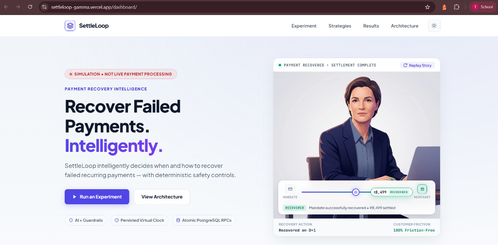
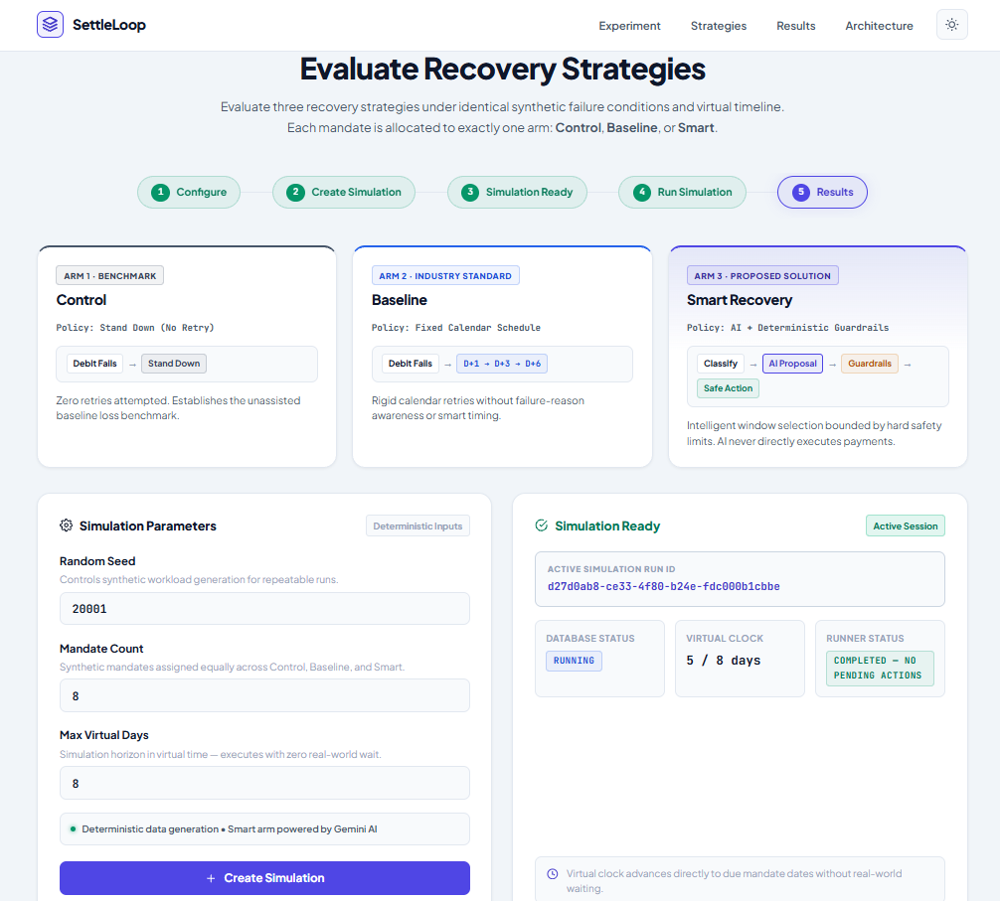
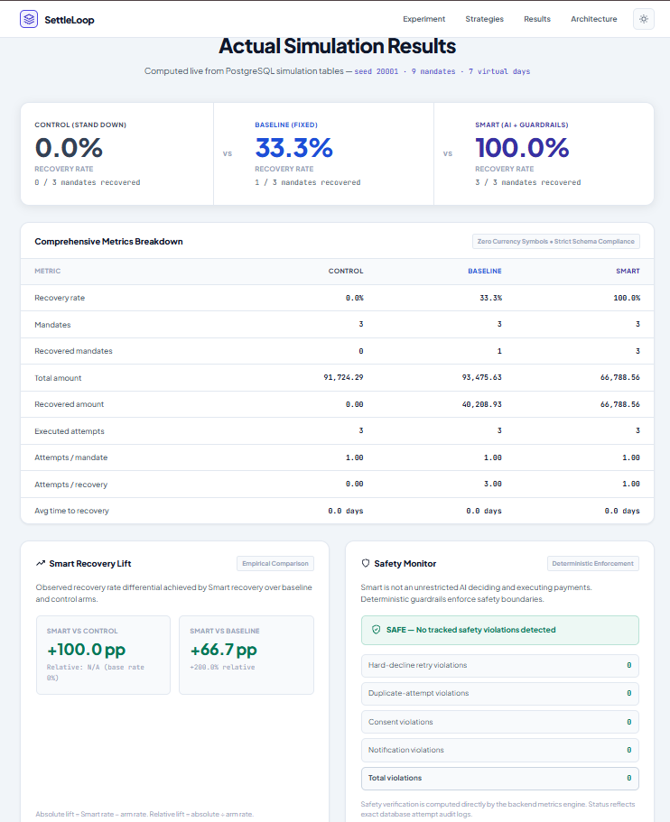
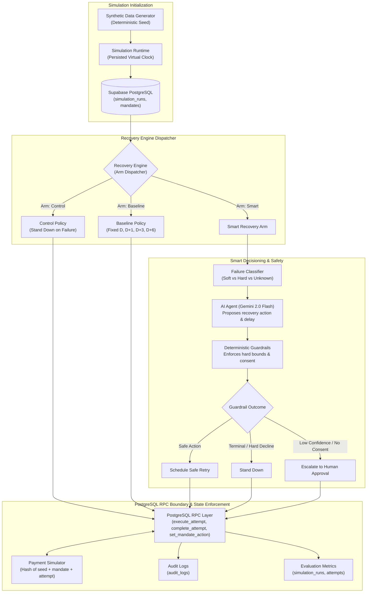

# SettleLoop

**AI-powered payment recovery intelligence for failed recurring payments.**

Built for the **Razorpay Buildathon**.

<p align="left">
  <a href="https://settleloop-gamma.vercel.app">
    
  </a>
  <a href="https://github.com/asawaricode/SettleLoop">
    
  </a>
</p>

<p align="left">
  
  
  
  
  
</p>

SettleLoop evaluates how failed recurring payments can be recovered more intelligently by comparing Control, Baseline, and Smart recovery strategies in a safe, simulation-driven environment.

> **Simulation Disclaimer:** All payment attempts in SettleLoop are deterministically simulated using cryptographic hash functions. SettleLoop does not process real money, connect to live banking rails, or initiate live Razorpay transactions.

---

## The Problem

Failed recurring payments should not simply be retried blindly. Different failure conditions require different recovery decisions, while unnecessary retries can waste attempts, trigger preventable customer friction, and accelerate involuntary churn.

---

## The Solution

SettleLoop benchmarks three distinct recovery strategies against the exact same synthetic workload and failure conditions:

- **Control** $\rightarrow$ No retry after the first failure (unassisted baseline)
- **Baseline** $\rightarrow$ Fixed calendar schedule ($D \rightarrow D+1 \rightarrow D+3 \rightarrow D+6$)
- **Smart** $\rightarrow$ Failure Classification $\rightarrow$ AI Proposal $\rightarrow$ Deterministic Guardrails $\rightarrow$ Safe Action / Human Approval

All three strategies operate against the identical synthetic simulation workload. SettleLoop does not claim Smart always performs better; rather, it measures the exact trade-offs between recovery rate, attempt efficiency, and safety compliance.

---

## Key Features

| Feature | Implemented Capability |
|:---|:---|
| **Synthetic Workload Generator** | Deterministic PRNG generates realistic recurring mandates with varying customer balance volatility, salary dates, and failure distributions. |
| **Persisted Virtual Clock** | Simulates multi-day recovery cycles instantly without real-world waiting; clock state is stored and stepped in PostgreSQL. |
| **Three Strategy Arms** | Concurrent evaluation of Control (no retry), Baseline (fixed calendar), and Smart (adaptive recovery) against identical cohorts. |
| **Failure Classification** | Maps raw payment failure error codes to semantic decline categories (`soft_decline`, `hard_decline`, `unknown`). |
| **Gemini Decision Engine** | Google Gemini 2.0 Flash (`temperature: 0`) proposes context-aware retry delays and recovery actions with automated deterministic fallback. |
| **Deterministic Guardrails** | Pure safety rules validate every AI proposal; hard declines are permanently stood down and attempt limits are strictly enforced. |
| **Human Approval Workflow** | Low-confidence proposals or missing consent trigger a formal `pending_human_approval` state with bounded virtual-day expiration. |
| **Atomic PostgreSQL RPCs** | Sensitive state transitions, attempt caps (max 4), and idempotency keys are enforced via database stored procedures. |
| **Payment Simulator** | Deterministic hash-based payment simulation produces reproducible success/failure outcomes for a given mandate seed and simulation inputs.|
| **Audit Logging** | Append-only audit table captures every decision, actor, reasoning, inputs, and outputs with zero secret exposure. |
| **Comprehensive Metrics** | Calculates recovery rates, recovered amounts, attempts per recovery, average recovery days, empirical lift, and safety violations. |
| **Interactive Dashboard** | Single-page UI with Light/Dark themes, stepper-driven configuration, real-time status indicators, and live metric tables. |

---

## Tech Stack

- **Frontend:** Vanilla HTML5, Modern CSS Design System (Custom tokens, glassmorphism, Light/Dark mode), Vanilla JavaScript (ES Modules, zero build step)
- **Backend:** Node.js (v18+), Express.js (REST API, input validation, client-server separation)
- **Database & Storage:** Supabase (PostgreSQL 15), PostgreSQL Stored Procedures (Atomic RPCs), Row-Level Security
- **AI & Reasoning:** Google Gemini 2.0 Flash via REST API (Structured JSON schema output, fallback heuristic engine)
- **Testing:** Node.js native test runner (`node:test`, `node:assert`)
- **Deployment:** Vercel (Edge-cached static frontend + Serverless Express API bridge via `api/index.js`)

---

## Real Product Screenshots

### Hero
*Visual product journey highlighting intelligent recovery and customer friction reduction.*

<p align="center">
  
</p>

---

### Experiment
*Strategy comparison strip, configurable simulation parameters, and real-time execution monitor.*

<p align="center">
  
</p>

---

### Results
*Comprehensive metrics breakdown, empirical Smart recovery lift, and deterministic safety monitor.*

<p align="center">
  
</p>

---

## Architecture



<p align="center">
  <strong>AI proposes. Guardrails validate. PostgreSQL RPCs enforce.</strong>
</p>

### Architecture in Brief

1. **Strict Arm Isolation:** Control and Baseline never interact with the Failure Classifier, Gemini AI, or Guardrails. They execute purely deterministic rule sets.
2. **AI Separated from Execution:** The Gemini AI agent proposes structured actions (`retry`, `retryDelayDays`, `reasoning`). It has zero direct execution permissions, database write access, or API key exposure.
3. **Deterministic Guardrail Filter:** Guardrails sit between AI output and state changes, enforcing immutable rules (e.g. hard declines always stand down; attempt caps $\le 4$).
4. **PostgreSQL RPC Boundary:** Sensitive attempt creation, status transitions, and idempotency checks are enforced exclusively inside atomic database stored procedures.
5. **Traceable Simulation:** Attempts are resolved through deterministic cryptographic hashes and recorded alongside full audit logs in PostgreSQL.

---

## Recovery Strategies

| Strategy | Decision Policy | Purpose | Retries Allowed |
|:---|:---|:---|:---:|
| **Control** | No retry after first failure | Establishes natural unassisted recovery baseline | 0 |
| **Baseline** | Fixed calendar schedule ($D \rightarrow D+1 \rightarrow D+3 \rightarrow D+6$) | Represents current standard industry retry benchmark | Up to 4 attempts |
| **Smart** | Classify $\rightarrow$ AI proposal $\rightarrow$ Guardrails $\rightarrow$ Safe action / Human review | Adapts timing and actions to failure category and customer context | Up to 4 attempts |

### Why Comparison Arms Matter

Without Control and Baseline, recovery performance cannot be objectively evaluated. Control answers what happens if no action is taken. Baseline demonstrates what happens with conventional calendar retries. Smart must prove its value over Baseline in recovery lift, attempt efficiency, and customer friction reduction under identical conditions.

---

## Smart Decisioning & Safety

```
Payment Failure ──► Failure Classifier ──► AI Proposal ──► Deterministic Guardrails ──► Safe Action / Human Approval
```

- **AI is Decision Support, Not Execution:** The AI model produces advisory proposals. It cannot call banking APIs or directly mutate database records.
- **Guardrails Enforce Hard Boundaries:** Guardrails validate every proposal against deterministic safety rules:
  - Any hard decline or unknown failure reason is forced to `stand_down` (zero automated retries).
  - Attempt counts $\ge 4$ trigger mandatory stand-down.
  - Proposals with confidence $< 0.70$ or payment links without contact consent escalate to `human_review`.
- **Human Approval is an Escalation State:** When escalated, the mandate transitions to `pending_human_approval` with an expiration window. It never directly executes a payment attempt.
- **Tamper-Evident Audit Logging:** Every decision, including actor, rule triggers, inputs, outputs, and reasoning, is written to the append-only `audit_logs` table.

---

## Simulation & Virtual Clock

A real recurring payment recovery cycle takes between 3 to 7 days. Waiting days in real time makes iterative experimentation impossible. SettleLoop resolves this through a **persisted virtual clock** (`simulation_runs.current_day`):

- **Event-Driven Advancement:** The recovery engine processes mandates due on day $D$, schedules future retries for day $D+k$, and advances the clock directly to the next scheduled action day.
- **Synthetic Mandates:** Generated deterministically from a configurable random seed, modeling customer attributes such as balance volatility, salary dates, and subscription amounts.
- **Deterministic Outcomes:** Payment results (success or specific decline reason) are computed via deterministic hashing of the seed, mandate ID, and attempt number.
- **Persisted State:** Simulation state is stored in Supabase, allowing any run to be inspected, replayed, and audited.

> **Note on AI Determinism:** While synthetic data generation, the payment simulator, and guardrails are 100% deterministic, responses from the Gemini API may exhibit slight natural variance. Fallback heuristics provide a deterministic backup when required.

---

## Data & Backend

### Core Tables

- **`simulation_runs`** — Run configuration, random seed, current virtual day, max days, and execution status (`running`, `completed`).
- **`mandates`** — Subscription mandates, customer profile attributes, assigned strategy arm, current status, and attempts used.
- **`attempts`** — Execution logs for each payment attempt: attempt number, executed virtual day, amount, outcome, failure code, and idempotency key.
- **`approval_requests`** — Pending human reviews: proposed action, confidence score, expiration day, and resolution status.
- **`audit_logs`** — Append-only audit trail logging actors, decision types, context payloads, and reasoning.

### PostgreSQL RPCs

All sensitive state transitions are handled by database stored procedures:

- **`execute_attempt`** — Atomically verifies attempt bounds ($< 4$), checks idempotency keys, and creates the attempt record.
- **`complete_attempt`** — Sets attempt outcome (`success` / `failed`) and updates mandate status to `recovered` or pending recovery.
- **`set_mandate_action`** — Updates mandate state (`retry`, `stood_down`, `exhausted`) and sets the next scheduled virtual day.
- **`create_approval_request`** — Atomically creates an approval request and transitions the mandate to `pending_human_approval`.
- **`resolve_approval`** — Resolves an approval request (`approved` / `rejected`) and advances the mandate state.
- **`expire_approval_requests`** — Scans and marks past-deadline approvals as expired, standing down associated mandates.

---

## API & Dashboard

The dashboard communicates exclusively with the Express REST API. The browser has zero direct access to Supabase database credentials or the Gemini API key.

```
Browser Dashboard ──► Express REST API ──► Recovery Engine / Guardrails ──► Supabase PostgreSQL
                                                │
                                                └──► Google Gemini API (Server-side only)
```

### Verified API Endpoints

| Method | Route | Description |
|:---|:---|:---|
| `GET` | `/api/health` | Service health check |
| `POST` | `/api/simulations` | Initializes a new simulation run with `{ seed, mandateCount, maxDays }` |
| `GET` | `/api/simulations/:runId` | Retrieves current simulation run state, virtual day, and status |
| `POST` | `/api/simulations/:runId/run` | Executes the simulation across Control, Baseline, and Smart arms |
| `GET` | `/api/simulations/:runId/metrics` | Calculates and returns comprehensive recovery and safety metrics |

---

## Metrics & Evaluation

SettleLoop calculates recovery and safety metrics from persisted database records:

| Metric | Definition |
|:---|:---|
| **Recovery Rate** | Percentage of mandates successfully recovered ($\text{Recovered Mandates} / \text{Total Mandates}$). |
| **Recovered Amount** | Total monetary value successfully settled across recovered mandates. |
| **Executed Attempts** | Total simulated payment attempts across all mandates in the arm. |
| **Attempts / Mandate** | Average retry overhead per customer. |
| **Attempts / Recovery** | Cost-efficiency ratio of attempts required per successful recovery. |
| **Average Time to Recovery** | Mean virtual days elapsed from first due date to successful settlement. |
| **Smart Recovery Lift** | Absolute percentage-point ($\text{pp}$) and relative ($\%$) recovery gain of Smart vs Baseline/Control. |
| **Safety Monitor** | Active tracking of hard-decline retries, duplicate attempts, and consent violations. |

---

### Example Run — Illustrative Result

*The following results reflect a real simulation run executed against live Supabase and Gemini.*  
*Not a general performance guarantee.*

**Run Parameters:** Seed `20001` · Mandate Count `9` (3 Control, 3 Baseline, 3 Smart) · Max Virtual Days `7`

| Metric | Control (Stand Down) | Baseline (Fixed Schedule) | Smart (AI + Guardrails) |
|:---|:---:|:---:|:---:|
| **Recovery Rate** | **0.0%** (0 / 3) | **33.3%** (1 / 3) | **100.0%** (3 / 3) |
| **Total Amount** | ₹91,724.29 | ₹93,475.63 | ₹66,788.56 |
| **Recovered Amount** | ₹0.00 | ₹40,208.93 | ₹66,788.56 |
| **Executed Attempts** | 3 | 3 | 3 |
| **Attempts / Mandate** | 1.00 | 1.00 | 1.00 |
| **Attempts / Recovery** | 0.00 | 3.00 | 1.00 |
| **Avg Time to Recovery** | 0.0 days | 0.0 days | 0.0 days |
| **Observed Lift** | — | — | **+66.7 pp** vs Baseline (+200.0% rel) |
| **Safety Violations** | 0 | 0 | **0 (SAFE — 100% compliant)** |

---

## Testing

The test suite uses the native Node.js test runner (`node:test`) and verifies all engine layers, safety invariants, and API contracts:

```bash
# Run all verified tests
npm test
```

### Verified Test Suite Breakdown

- **Total Test Suites:** 10 suites in `tests/` (`step10.test.js` through `step19.test.js`)
- **Total Test Cases:** 191 automated test declarations
  - Step 10: Recovery Engine Arm Isolation & Dispatch (16 tests)
  - Step 11: Recovery Runner & Virtual Clock Jumping (9 tests)
  - Step 12: Failure Classification Taxonomy (9 tests)
  - Step 13: Smart Agent Gemini Integration & Heuristic Fallback (24 tests)
  - Step 14: Deterministic Guardrails & Safety Invariants (29 tests)
  - Step 15: Human Approval Lifecycle & Expiration (33 tests)
  - Step 16: Evaluation Metrics Precision & Violation Monitors (29 tests)
  - Step 17: Express REST API Endpoints & Validations (13 tests)
  - Step 18: Multi-Arm Smart Integration (18 tests)
  - Step 19: End-to-End Stress & Repeat-Execution Safety (11 tests)

---

## Local Setup

### Prerequisites
- Node.js 18+
- Supabase account & project (with SettleLoop schema and RPCs applied)
- Google Gemini API key

### 1. Clone & Install Dependencies
```bash
git clone https://github.com/asawaricode/SettleLoop.git
cd SettleLoop
npm install
```

### 2. Configure Environment Variables
Create a `.env` file in the project root:
```bash
cp .env.example .env
```

Populate the required environment variables:
```env
SUPABASE_URL=https://<your-project-ref>.supabase.co
SUPABASE_SECRET_KEY=<your-supabase-service-role-key>
GEMINI_API_KEY=<your-gemini-api-key>
```

> **Security Note:** Secrets are used exclusively on the server. Never commit `.env` or expose service role keys to clients.

### 3. Start the Server
```bash
npm start
```
Server will start at `http://localhost:3000`.

### 4. Open the Dashboard
Navigate to:
```
http://localhost:3000/dashboard/
```

---

## Deployment

SettleLoop is deployed on **Vercel** as a unified full-stack web application:

- **Live Application:** [https://settleloop-gamma.vercel.app](https://settleloop-gamma.vercel.app)
- **Edge Static Assets:** Dashboard files in `public/dashboard/` are served at the edge.
- **Serverless API Bridge:** `api/index.js` exports the Express application as a Vercel Serverless Function handling all `/api/*` routes.
- **Route Redirection:** `vercel.json` automatically redirects `/` and `/dashboard` to `/dashboard/`.

---

## Engineering Decisions

- **Why Simulation Instead of Live Payments:** Real recurring payments carry financial consequences and strict bank pacing rules. A simulation sandbox allows safe, repeatable experimentation and benchmarking without risking real money or customer relationships.
- **Why a Persisted Virtual Clock:** Real recovery spans days. Storing the virtual clock in PostgreSQL allows running multi-day journeys in seconds while maintaining strict state persistence and audit trails.
- **Why Control and Baseline Arms:** Rigorous benchmarking demands identical cohorts. Control measures the zero-intervention baseline; Baseline measures fixed calendar retries.
- **Why AI is Separated from Execution:** LLMs can hallucinate or suggest unsafe parameters. SettleLoop restricts Gemini to advisory proposals, guaranteeing that deterministic guardrails and PostgreSQL RPCs retain execution authority.
- **Why Deterministic Guardrails:** Hard safety constraints (e.g., never retry stolen cards, obey attempt limits) must never depend on probabilistic AI outputs.
- **Why PostgreSQL RPCs for State Transitions:** Atomic database transactions prevent race conditions, enforce attempt limits, and maintain strict idempotency across concurrent operations.
- **Why Full Audit Logs:** Financial recovery systems require complete accountability. Every decision, reasoning payload, and timestamp is immutably logged.

---

## Scope & Limitations

In the interest of technical transparency:

- **Simulated Payments:** SettleLoop is a research and benchmarking simulation platform. It does not integrate with live banking rails or execute live Razorpay transactions.
- **Experimental AI Decisioning:** AI-assisted recovery is an experimental decision-support mechanism. Responses depend on prompt context and model availability.
- **Human Approval Interaction Gap:** While `src/recovery/humanApproval.js` fully implements and tests human approval logic (`requestHumanApproval`, `resolve_approval`, `expireHumanApprovals`), during automated simulation runs (`POST /api/simulations/:runId/run`), approvals are evaluated via timeout and auto-expiration (`expireHumanApprovals`). There is currently no interactive frontend modal or HTTP endpoint in `routes.js` to manually resolve pending approvals mid-simulation.
- **Not a Production Benchmark:** Metrics produced from synthetic customer cohorts demonstrate simulation mechanics and should not be taken as real-world recovery guarantees.
