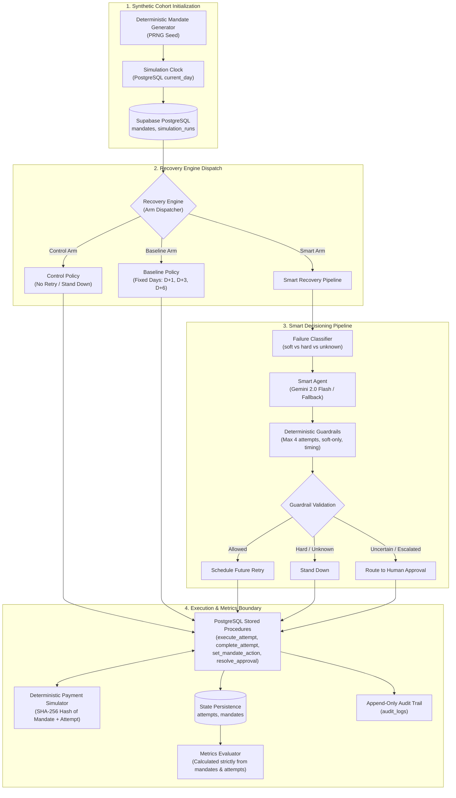
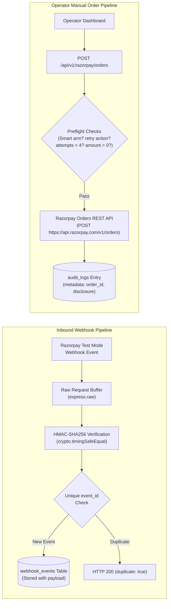
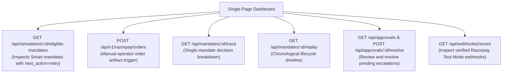

# SettleLoop

**Payment recovery evaluation engine comparing Control, Baseline, and Smart recovery policies in a simulation environment, with an isolated Razorpay Test Mode integration.**

Built for the **Razorpay Buildathon**.

<p align="left">
  <a href="https://settleloop-gamma.vercel.app">
    
  </a>
  <a href="https://github.com/asawaricode/SettleLoop">
    
  </a>
</p>

<p align="left">
  
  
  
  
  
</p>

---

## 1. Project Positioning & System Scope

SettleLoop is an experimental research and benchmarking platform designed to study payment recovery policies under controlled conditions. The project is **not** production payment infrastructure, does not connect to live banking rails, and does not process real customer funds.

The codebase consists of **two strictly separated worlds**:

```
┌────────────────────────────────────────────────────────────────────────┐
│                        WORLD A: SYNTHETIC EXPERIMENT                  │
│                                                                        │
│  Deterministic PRNG ──► Virtual Clock ──► Payment Simulator            │
│                              │                                         │
│                              ▼                                         │
│            Control  │  Baseline  │  Smart Policy                       │
│                              │                                         │
│                              ▼                                         │
│         Failure Classifier ──► AI / Fallback ──► Guardrails            │
│                              │                                         │
│                              ▼                                         │
│                   PostgreSQL RPC Execution                             │
│                              │                                         │
│                              ▼                                         │
│           Synthetic Experiment Metrics (mandates, attempts)            │
└────────────────────────────────────────────────────────────────────────┘
                                 ▲
                          STRICT ISOLATION
                    (Verified by Integration Tests)
                                 ▼
┌────────────────────────────────────────────────────────────────────────┐
│                   WORLD B: REAL RAZORPAY TEST MODE                     │
│                                                                        │
│  Inbound Webhooks (HMAC-SHA256) ──► webhook_events (Idempotent)        │
│                                                                        │
│  Operator Dashboard ──► Manual Orders API ──► Real Test Mode Artifact  │
│                                                                        │
│  * Note: This creates a real Razorpay Test Mode order artifact.        │
│    It is not a payment retry and does not execute a payment.           │
└────────────────────────────────────────────────────────────────────────┘
```

### World A: Synthetic Recovery Experiment
- **Deterministic Workload Generation:** Seeded pseudo-random generation of recurring mandates modeling subscription pricing, billing cycle days, and balance volatility.
- **Persisted Virtual Clock:** Multi-day recovery cycles advance instantaneously in virtual days (`current_day`) stored in PostgreSQL.
- **Simulated Payment Outcomes:** Deterministic cryptographic hashing of simulation parameters simulates bank approval, soft declines, and hard declines without network delays.
- **Comparative Strategy Arms:** Concurrent execution of Control (no retry), Baseline (fixed calendar retry), and Smart (classified retry with safety guardrails) against identical cohorts.
- **Decision Engine & Guardrails:** Failure classification, recovery action proposals (Gemini 2.0 Flash or deterministic heuristic fallback), and immutable safety guardrail filtering.
- **Database Enforcement:** State transitions, attempt caps, and idempotency verified atomically via PostgreSQL stored procedures (RPCs).
- **Synthetic Metrics:** Recovery rates, recovered volume, attempt efficiency, and recovery lift calculated solely from synthetic experiment tables.

### World B: Real Razorpay Test Mode Integration
- **Real Signed Webhooks:** Ingestion of genuine Razorpay Test Mode webhook deliveries via `POST /api/v1/webhooks/razorpay`.
- **Raw-Body HMAC Verification:** Constant-time cryptographic signature validation (`timingSafeEqual`) against raw payload bytes before JSON parsing.
- **Idempotent Ingestion:** Persistent deduplication using a unique index on `event_id` in PostgreSQL (`webhook_events`).
- **Manual Test Mode Orders:** Operator-triggered creation of real Razorpay Test Mode orders via `POST /api/v1/razorpay/orders` for eligible Smart mandates.
- **Clear Operational Boundary:** This creates a real Razorpay Test Mode order artifact. It is not a payment retry and does not execute a payment.
- **Zero Cross-Contamination:** Inbound webhooks and manual Test Mode order creations do not modify mandate states, create attempt rows, or alter simulation metrics.

---

## 2. Architecture & Data Flow

### A. Synthetic Experiment Architecture



### B. Real Razorpay Test Mode Data Flow



### C. Dashboard Observability Flow



### Verification of Boundary Isolation
Isolation between synthetic experiment state and real Razorpay activity has been verified through automated integration tests (`tests/step20.test.js`, `tests/step21.test.js`, and `tests/step23.test.js`):
- Webhook ingestion does not write to `mandates` or `attempts`.
- Manual Test Mode order generation does not increment `attempts_used`, does not create an `attempts` record, and does not alter simulation recovery metrics.
- Simulation execution files do not import or invoke Razorpay order or webhook handlers.

---

## 3. Real Razorpay Test Mode Integration

The repository implements a genuine Razorpay Test Mode integration interacting with Razorpay's live servers in Test Mode, without installing third-party SDK wrappers.

### Webhook Ingestion (`POST /api/v1/webhooks/razorpay`)
- **Raw-Body Buffer Capture:** Route-level middleware `express.raw({ type: 'application/json' })` captures the unprocessed request body bytes before `express.json()` executes.
- **HMAC-SHA256 Verification:** `verifyRazorpaySignature()` calculates `crypto.createHmac('sha256', secret).update(rawBody).digest('hex')` and validates it against the `X-Razorpay-Signature` header.
- **Timing-Safe Comparison:** Compares the calculated hash and header signature using `crypto.timingSafeEqual` to eliminate timing side-channel attacks.
- **Deduplication & Idempotency:** The payload is stored in the `webhook_events` PostgreSQL table, guarded by a unique index on `event_id`. Duplicate deliveries (PostgreSQL error code `23505`) return HTTP 200 with `{ received: true, duplicate: true }` without re-processing.
- **No Side Effects on Simulation:** Inbound webhooks record external event receipts. They do not trigger retries, update mandate statuses, or alter experiment metrics.

### Manual Test Mode Order Creation (`POST /api/v1/razorpay/orders`)
- **Manual-Only Trigger:** Dedicated operator endpoint requiring explicit invocation. Blocked if incoming request headers include `x-automated-batch: 1`.
- **Preflight Guards:** Validates that the targeted mandate:
  1. Belongs to the `smart` experiment arm (`experiment_arm === 'smart'`).
  2. Currently has a `retry` decision (`next_action === 'retry'`).
  3. Complies with the attempt ceiling (`attempts_used < 4`).
  4. Has a valid positive currency amount (`amount > 0`).
- **REST API Call:** Issues a direct HTTPS POST request to `https://api.razorpay.com/v1/orders` using HTTP Basic Authentication (`RAZORPAY_KEY_ID:RAZORPAY_KEY_SECRET`).
- **Payload Sanitization:** Sends only `amount` (converted to paise for INR) and `currency`. Customer PII (name, email, phone) is never transmitted, and `notify` is never set to true.
- **Audit Persistence:** The resulting Razorpay order ID and status are logged to `audit_logs` under `decision_type = 'razorpay_order_created'` with full metadata and the required disclosure string. No attempt row is created in `attempts`.
- **Mandatory Disclosure:** Every response returns the disclosure:
  > *"This creates a real Razorpay Test Mode order artifact. It is not a payment retry and does not execute a payment."*

---

## 4. Recovery Policies & Guardrails

### Comparative Strategy Arms

| Strategy | Decision Policy | Attempt Limits | Execution Path |
|:---|:---|:---|:---|
| **Control** | No retry after initial failure | 1 initial attempt (0 retries) | Evaluates day 0. On failure, immediately stands down. |
| **Baseline** | Fixed calendar schedule ($D \rightarrow D+1 \rightarrow D+3 \rightarrow D+6$) | UPI AutoPay retry guardrail: max 4 total attempts (1 initial + 3 retries). | Deterministic fixed-day scheduling. Unassisted calendar baseline. |
| **Smart** | Classify $\rightarrow$ Propose $\rightarrow$ Guardrails $\rightarrow$ Action | UPI AutoPay retry guardrail: max 4 total attempts (1 initial + 3 retries). | Classifies decline reason, consults AI or fallback heuristic, filters via guardrails. |

### Smart Decision Pipeline
1. **Failure Classification:** Maps gateway decline codes into normalized semantic categories:
   - `soft_decline` (e.g., temporary insufficient balance, network timeout) $\rightarrow$ `retryEligible: true`
   - `hard_decline` (e.g., stolen card, mandate cancelled, account closed) $\rightarrow$ `retryEligible: false`
   - `unknown` (unrecognized or missing failure code) $\rightarrow$ `retryEligible: false`
2. **AI Action Proposal (`smartAgent.js`):**
   - Calls Google Gemini 2.0 Flash (`temperature: 0`, structured JSON output) proposing `{ action, retryDelayDays, reasoning }`.
   - If the API times out or returns an error, switches to a deterministic heuristic fallback.
3. **Deterministic Guardrails (`guardrails.js`):**
   - **Hard Failures Stand Down:** Hard declines and unknown categories are permanently stood down with zero retries.
   - **Attempt Ceiling:** UPI AutoPay retry guardrail: max 4 total attempts (1 initial + 3 retries). Mandates with `attempts_used >= 4` transition to `exhausted`.
   - **Delay Range:** Scheduled retry delays must be integers between 0 and 7 virtual days.
   - **Consent Verification:** Alternative channels such as payment links require explicit `contact_consent === true`.

### Confidence & Human Review Implementation
- **Current Confidence Behavior:** The current deterministic policy uses a fixed confidence of 0.80, so the <0.70 human-review confidence threshold cannot currently trigger in practice.
- **Model Output Schema:** Gemini's response schema provides `{ action, retryDelayDays, reasoning }` but does not output a dynamic confidence probability.
- **Defensive Boundary:** The <0.70 threshold in `guardrails.js` is implemented as an architectural safety boundary.
- **Approval Workflow:** Human approval records can be created via `requestHumanApproval()`, queried via `GET /api/approvals`, and resolved by operators using `POST /api/approvals/:id/resolve` (`decision: 'approved' | 'rejected'`). In automated batch simulations, unreviewed approvals auto-expire deterministically at their virtual deadline (`expireHumanApprovals`).

---

## 5. Observability, Replay & Auditability

SettleLoop provides auditable decision inspection derived entirely from stored relational data without requiring third-party tracing agents.

| Capability | Endpoint / Mechanism | Description |
|:---|:---|:---|
| **Decision Trace** | `GET /api/mandates/:id/trace` | Reconstructs the latest decision context for a single mandate: experiment arm, failure category, AI proposal, guardrail outcome, scheduled retry day, and pending approval state. |
| **Decision Replay** | `GET /api/mandates/:id/replay` | Assembles a complete chronological lifecycle timeline from creation to termination using stored rows from `mandates`, `attempts`, `audit_logs`, and `approval_requests`. |
| **Approval Management** | `GET /api/approvals`<br/>`POST /api/approvals/:id/resolve` | Operator interface for viewing and resolving pending human approval escalations. |
| **Webhook Status** | `GET /api/webhooks/recent` | Returns recent verified inbound webhook receipts directly from PostgreSQL `webhook_events`. |
| **Audit Log Table** | `audit_logs` | Immutable audit log capturing actor, decision type, input context, output actions, reasoning, and optional JSONB metadata. |

*Note: SettleLoop does not implement user authentication, multi-tenant RBAC, or distributed OpenTelemetry tracing.*

---

## 6. Database Schema & Stored Procedures

The database layer runs on Supabase PostgreSQL with atomic stored procedures managing sensitive lifecycle transitions.

### Relevant Tables

```
                    ┌───────────────────────────┐
                    │      simulation_runs      │
                    │───────────────────────────│
                    │ id (PK, UUID)             │
                    │ random_seed (BIGINT)      │
                    │ current_day (INT)         │
                    │ max_days (INT)            │
                    │ status (TEXT)             │
                    │ created_at (TIMESTAMPTZ)  │
                    └─────────────┬─────────────┘
                                  │ 1:N
                                  ▼
┌───────────────────────────┐   ┌───────────────────────────┐
│      webhook_events       │   │         mandates          │
│───────────────────────────│   │───────────────────────────│
│ id (PK, UUID)             │   │ id (PK, UUID)             │
│ event_id (UNIQUE, TEXT)   │   │ mandate_id (TEXT, 'M-1')  │
│ event_type (TEXT)         │   │ run_id (FK, UUID)         │
│ payload (JSONB)           │   │ experiment_arm (TEXT)     │
│ signature_verified (BOOL) │   │ amount (NUMERIC)          │
│ received_at (TIMESTAMPTZ) │   │ status (TEXT)             │
└───────────────────────────┘   │ attempts_used (INT)       │
                                │ first_due_day (INT)       │
                                │ next_action (TEXT)        │
                                │ next_action_day (INT)     │
                                └──────┬──────────────┬─────┘
                                       │ 1:N          │ 1:N
                    ┌──────────────────┘              └──────────────────┐
                    ▼                                                    ▼
┌───────────────────────────┐   ┌───────────────────────────┐   ┌───────────────────────────┐
│         attempts          │   │        audit_logs         │   │     approval_requests     │
│───────────────────────────│   │───────────────────────────│   │───────────────────────────│
│ id (PK, UUID)             │   │ id (PK, UUID)             │   │ id (PK, UUID)             │
│ mandate_id (FK, UUID)     │   │ run_id (FK, UUID)         │   │ run_id (FK, UUID)         │
│ run_id (FK, UUID)         │   │ mandate_id (FK, UUID)     │   │ mandate_id (FK, UUID)     │
│ attempt_number (INT)      │   │ attempt_id (FK nullable)  │   │ proposed_action (JSONB)   │
│ executed_day (INT)        │   │ actor (TEXT)              │   │ status (TEXT)             │
│ channel (TEXT)            │   │ decision_type (TEXT)      │   │ expires_day (INT)         │
│ outcome (TEXT)            │   │ input (JSONB)             │   │ decided_by (TEXT)         │
│ decline_category (TEXT)   │   │ output (JSONB)            │   │ decided_at (TIMESTAMPTZ)  │
│ retry_eligible (BOOL)     │   │ metadata (JSONB)          │   │ created_at (TIMESTAMPTZ)  │
│ idempotency_key (TEXT)    │   │ created_at (TIMESTAMPTZ)  │   └───────────────────────────┘
└───────────────────────────┘   └───────────────────────────┘
```

### PostgreSQL Stored Procedures (Atomic RPCs)
- **`execute_attempt`:** Atomically creates an attempt record, checks the maximum attempt ceiling (`attempts_used < 4`), increments `attempts_used`, and guarantees idempotency.
- **`complete_attempt`:** Records attempt outcome (`success` / `failure`), failure classification codes, and advances recovered mandates to `status = 'recovered'`.
- **`set_mandate_action`:** Sets the scheduled action (`retry`, `stand_down`, `exhausted`) and next virtual action day.
- **`create_approval_request`:** Transitions mandate to `pending_human_approval` and inserts an approval record with an expiration day.
- **`resolve_approval`:** Resolves approval requests (`approved` returns mandate to retry; `rejected` stands down mandate).
- **`expire_approval_requests`:** Automatically marks past-deadline approvals as expired and stands down associated mandates.

---

## 7. Metrics & Evaluation Methodology

Synthetic recovery performance is evaluated through `getSimulationMetrics()`, which executes read-only SQL queries against:
1. `simulation_runs`
2. `mandates`
3. `attempts`

`audit_logs`, `webhook_events`, and real Razorpay Test Mode orders **do not** participate in experiment metrics calculation.

### Computed Metrics per Arm
- **Recovery Rate:** Proportion of mandates transitioned to `recovered` ($\text{Recovered} / \text{Total Mandates}$).
- **Recovered Volume:** Total monetary value collected across recovered mandates.
- **Attempts per Recovery:** Total executed attempts divided by total recoveries (cost-efficiency metric).
- **Average Time to Recovery:** Mean virtual days elapsed from first due day to successful recovery.
- **Smart Lift vs Baseline & Control:** Both absolute percentage-point ($\text{pp}$) and relative ($\%$) recovery differences:
  $$\text{Absolute Lift} = \text{Rate}_{\text{Smart}} - \text{Rate}_{\text{Comparison}}$$
  $$\text{Relative Lift} = \frac{\text{Rate}_{\text{Smart}} - \text{Rate}_{\text{Comparison}}}{\text{Rate}_{\text{Comparison}}}$$
- **Safety Violation Monitors:** Active counts of hard-decline retries, duplicate attempts, and customer consent violations.

---

## 8. Determinism & Reproducibility

### Determinism Resolution
Earlier iterations exhibited stochastic variance caused by passing non-deterministic PostgreSQL random UUIDs into the payment outcome simulator. This was resolved:
- The simulation runtime utilizes deterministic synthetic identifiers (`mandate_id` formatted as `M-1`, `M-2`, ...) paired with the run seed to initialize PRNG states and SHA-256 hashes.
- In deterministic mode (`benchmark: true`), recovery evaluations bypass stochastic LLM calls, executing identical deterministic heuristic decisions.
- Verified in `tests/determinism.test.js`: two completely fresh simulation runs generated with identical parameters (`seed: 20001`, `mandateCount: 9`, `maxDays: 7`) produce byte-for-byte identical database statuses, attempt counts, and metrics.

### Local CLI Runner
For reproducible local execution outside HTTP timeouts, use `scripts/run-recovery-cli.js`:
```bash
# Execute recovery for an existing simulation run in deterministic benchmark mode
node scripts/run-recovery-cli.js <runId> --deterministic
```

---

## 9. Benchmark Status & Empirical Findings

### Current Benchmark Status
> **Benchmark Notice:** A large-scale comparative benchmark ($n \ge 300$) executed under the corrected deterministic benchmark pipeline is **pending a fresh post-fix run**. Stale pre-fix benchmark figures (such as earlier stochastic seed-42000 runs) have been deprecated and are not presented as current performance claims.

### Verified Deterministic Reproducibility Run (Small Cohort)
To verify reproducible mechanics across Control, Baseline, and Smart arms under exact deterministic conditions, a 9-mandate verification run was recorded:
- **Seed:** `20001`
- **Total Mandates:** `9` (3 Control, 3 Baseline, 3 Smart)
- **Schedule Window:** `7` virtual days
- **Execution Mode:** Deterministic benchmark mode

| Metric | Control (No Retry) | Baseline (Fixed Schedule) | Smart (Adaptive Policy) |
|:---|:---:|:---:|:---:|
| **Mandate Count** | 3 | 3 | 3 |
| **Recovery Rate** | 100.0% (3 / 3) | 66.67% (2 / 3) | 66.67% (2 / 3) |
| **Total Amount** | ₹91,724.29 | ₹93,475.63 | ₹66,788.56 |
| **Recovered Amount** | ₹91,724.29 | ₹53,266.70 | ₹26,855.69 |
| **Executed Attempts** | 3 | 3 | 5 |
| **Attempts / Mandate** | 1.00 | 1.00 | 1.67 |
| **Avg Time to Recovery** | 0.0 days | 0.0 days | 2.0 days |
| **Smart Lift vs Baseline** | — | — | **0.00 pp** (0.0% rel) |
| **Smart Lift vs Control** | — | — | **-33.33 pp** (-33.33% rel) |
| **Safety Violations** | 0 | 0 | **0 (100% compliant)** |

*Interpretation:* In this small test cohort, Control experienced zero initial payment declines, achieving natural recovery. Smart matched Baseline's recovery rate (66.67%) while testing retry evaluations over 5 attempts. This small cohort demonstrates determinism and safety compliance, not statistically significant comparative performance superiority.

---

## 10. Automated Testing & Verification

The test suite runs on Node.js's native test runner (`node:test`) and contains **17 test suites** covering unit logic, state machines, API routes, database RPCs, and Razorpay integrations.

```bash
# Execute the full test suite
npm test
```

### Test Suite Status (Latest Verified Run)
- **Total Tests:** 254
- **Passed:** 250
- **Failed:** 4
- **Newly Introduced Failures:** 0

### Passing Test Groups
- **Step 20 — Razorpay Real Integration (22 tests):** Webhook raw-body verification, timingSafeEqual comparison, idempotency index, manual order creation, attempt guardrails, secret protection.
- **Step 21 — API Hardening (7 tests):** Rate limiting, Zod payload validation, batch header isolation (`x-automated-batch: 1`).
- **Step 22 — Dashboard UX Corrections (7 tests):** Eligible mandate filtering, trace endpoints, approval lifecycle queries.
- **Step 23 — Final Integration & Isolation (10 tests):** Real webhook ingestion, approval concurrency resolution, manual order creation, and byte-for-byte database isolation verification.
- **Step 24 — Decision Replay (17 tests):** Replay envelope structure, chronological event ordering, audit log parsing, and read-only query isolation.
- **Determinism Suite (1 test):** Dual-run identical outcome verification across fresh database UUIDs.
- **Steps 10–16 (176 tests):** Arm dispatch, runner clock advancement, failure classification, guardrail invariants, approval states, and metrics calculations.

### Pre-Existing Baseline Failures
The 4 recorded failures represent historical regression assertions from earlier phases:
1. `tests/step17.test.js:153` (`6. POST /run uses the existing recovery runner`): Asserts that Smart arm mandates have 0 attempts after `/run`. This test was written prior to Step 18 enabling Smart arm processing in the runner.
2. `tests/step18.test.js:309` (`4. Previous failure: Failure Classifier runs and passes category to Smart Agent`): Asserts the Gemini API mock intercept count.
3. `tests/step18.test.js:548` (`8. Guardrail stand_down: existing stand_down RPC used; no attempt created`): Asserts mandate status is `stood_down` or `pending`; the simulated payment attempt succeeded, transitioning the mandate to `recovered`.
4. `tests/step19.test.js:418` (`3. Attempt safety: zero/same-day delay is safely scheduled for next day`): Assertion regarding null `next_action_day` on retry adjustment.

---

## 11. Security & Safety Controls

| Category | Implemented Control | File / Mechanism |
|:---|:---|:---|
| **Webhook Authentication** | Raw-buffer HMAC-SHA256 signature verification | `src/api/razorpayWebhook.js` |
| **Side-Channel Defense** | Constant-time signature comparison using `crypto.timingSafeEqual` | `src/api/razorpayWebhook.js` |
| **Webhook Idempotency** | PostgreSQL unique constraint index on `event_id` | `db/migrations/001_phase1_webhook_events.sql` |
| **Request Validation** | Strict Zod body parsing on simulation, order, and approval routes | `src/api/validation.js` |
| **Rate Limiting** | `express-rate-limit` on general API, webhooks, and manual orders | `src/middleware/rateLimiter.js` |
| **Batch Isolation** | Manual order route rejects `x-automated-batch: 1` with HTTP 403 | `src/api/razorpayOrder.js` |
| **Payment Attempt Cap** | UPI AutoPay retry guardrail: max 4 total attempts (1 initial + 3 retries) | `src/recovery/guardrails.js`, DB RPCs |
| **Credential Hygiene** | Supabase service key, Gemini key, and Razorpay keys isolated server-side | `server.js`, `src/config/supabase.js` |

*Security Boundaries: The application does not implement user login, session management, or customer-facing payment authentication.*

---

## 12. End-to-End Demo Workflow

1. **Initialize Simulation:**  
   Navigate to the dashboard or call `POST /api/simulations` with `{ seed: 20001, mandateCount: 9, maxDays: 7 }`.
2. **Execute Multi-Arm Run:**  
   Call `POST /api/simulations/:runId/run` (with `{ "deterministic": true }` for deterministic benchmark execution).
3. **Inspect Recovery Metrics:**  
   Call `GET /api/simulations/:runId/metrics` to review Control, Baseline, and Smart recovery rates, attempt counts, and lift.
4. **Inspect Decision Trace & Replay:**  
   Select a mandate to query `GET /api/mandates/:id/trace` and `GET /api/mandates/:id/replay` for timeline reconstruction.
5. **Review Human Approvals (if escalated):**  
   Query `GET /api/approvals` and resolve via `POST /api/approvals/:id/resolve` (`approved` or `rejected`).
6. **Deliver Real Razorpay Test Mode Webhook:**  
   Send a signed test payload to `POST /api/v1/webhooks/razorpay` and inspect `GET /api/webhooks/recent`.
7. **Create Real Test Mode Order Artifact:**  
   Select an eligible Smart mandate and trigger `POST /api/v1/razorpay/orders`.  
   *Note: This creates a real Razorpay Test Mode order artifact. It is not a payment retry and does not execute a payment.*
8. **Verify System Isolation:**  
   Re-fetch simulation metrics to verify that webhook ingestion and manual order creation caused zero changes to synthetic experiment tables.

---

## 13. System Limitations

- **Test Mode Only:** Razorpay integration is strictly restricted to Test Mode credentials and test endpoints.
- **Order Artifacts Only:** Manual Test Mode order creation generates an external order record for demonstration; it does not process a payment or trigger a bank retry.
- **No Production Rails:** SettleLoop does not connect to live banking networks or live UPI AutoPay rails.
- **No Authentication / RBAC:** The API and dashboard operate without user authentication or role-based access control.
- **Fixed Policy Confidence:** The current deterministic policy uses a fixed confidence of 0.80, so the <0.70 human-review confidence threshold cannot currently trigger in practice.
- **Pending Large-Scale Benchmark:** A large-n ($n \ge 300$) comparative evaluation under the post-fix deterministic runner is pending execution.
- **Synthetic Results Disclaimer:** Metrics derived from synthetic cohorts illustrate policy mechanics and do not predict real-world recovery performance.

---

## 14. Project Structure

```
SettleLoop/
├── api/
│   └── index.js                      # Vercel serverless function entrypoint
├── db/
│   └── migrations/
│       └── 001_phase1_webhook_events.sql  # Webhook events table & audit metadata
├── public/
│   └── dashboard/
│       ├── app.js                    # Dashboard UI client logic
│       ├── index.html                # Single-page dashboard HTML
│       └── styles.css                # CSS design system (tokens, themes)
├── scripts/
│   └── run-recovery-cli.js           # CLI runner for local/benchmark execution
├── src/
│   ├── api/
│   │   ├── razorpayOrder.js          # Manual Razorpay Test Mode order creation
│   │   ├── razorpayWebhook.js        # Inbound signed webhook ingestion handler
│   │   ├── routes.js                 # Express REST API endpoints
│   │   └── validation.js             # Zod request validation schemas
│   ├── config/
│   │   └── supabase.js               # Supabase PostgreSQL client initialization
│   ├── evaluation/
│   │   └── metrics.js                # Read-only experiment metrics computation
│   ├── generators/
│   │   └── syntheticDataGenerator.js # Seeded synthetic mandate generator
│   ├── middleware/
│   │   └── rateLimiter.js            # express-rate-limit configuration
│   ├── recovery/
│   │   ├── baselinePolicy.js         # Baseline fixed-schedule retry policy
│   │   ├── controlPolicy.js          # Control stand-down policy
│   │   ├── failureClassifier.js      # Error code categorization taxonomy
│   │   ├── guardrails.js             # Deterministic safety rule validation
│   │   ├── humanApproval.js          # Escalation creation and resolution
│   │   ├── recoveryEngine.js         # Mandate processor and arm dispatcher
│   │   ├── recoveryRunner.js         # Multi-arm runner and virtual clock stepping
│   │   ├── smartAgent.js             # Gemini AI decision proposal & fallback
│   │   └── smartPolicy.js            # Smart recovery execution pipeline
│   ├── simulators/
│   │   └── paymentSimulator.js       # Deterministic hash-based payment simulator
│   └── stateMachine/
│       └── mandateStateMachine.js    # Mandate lifecycle transition assertions
├── tests/
│   ├── determinism.test.js           # Determinism & reproducibility test suite
│   ├── step10.test.js ... step19.test.js  # Phase 1 & 2 integration test suites
│   ├── step20.test.js                # Razorpay Real Integration tests
│   ├── step21.test.js                # API Hardening tests
│   ├── step22.test.js                # Dashboard UX Correction tests
│   ├── step23.test.js                # Final Integration & Isolation tests
│   └── step24.test.js                # Decision Replay tests
├── package.json                      # Dependencies and test runner script
├── server.js                         # Local Express server entrypoint
└── vercel.json                       # Vercel deployment routing configuration
```

---

## 15. Local Development Setup

### Prerequisites
- Node.js 18 or higher
- Supabase project with database schema and RPCs applied
- Google Gemini API key (optional for deterministic benchmark mode)
- Razorpay Test Mode API keys (optional for World B features)

### 1. Clone & Install Dependencies
```bash
git clone https://github.com/asawaricode/SettleLoop.git
cd SettleLoop
npm install
```

### 2. Configure Environment Variables
Create a `.env` file in the project root based on `.env.example`:
```bash
cp .env.example .env
```

Set the required environment keys:
```env
# Required for Database Access
SUPABASE_URL=https://<your-project-ref>.supabase.co
SUPABASE_SECRET_KEY=<your-supabase-service-role-key>

# Required for AI Decisioning (Optional in Benchmark Mode)
GEMINI_API_KEY=<your-gemini-api-key>

# Required for Razorpay Test Mode Features (Optional for Synthetic Simulation)
RAZORPAY_KEY_ID=<your-test-mode-key-id>
RAZORPAY_KEY_SECRET=<your-test-mode-key-secret>
RAZORPAY_WEBHOOK_SECRET=<your-configured-webhook-secret>

# Server Configuration
PORT=3000
NODE_ENV=development
```

### 3. Start the Application
```bash
npm start
```
The server will bind to `http://localhost:3000`. Access the dashboard at:
```
http://localhost:3000/dashboard/
```

### 4. Run Automated Tests
```bash
npm test
```

### 5. Run Reproducible CLI Simulation
```bash
# Execute a simulation run in deterministic benchmark mode
node scripts/run-recovery-cli.js <runId> --deterministic
```

---

## 16. Deployment Configuration

SettleLoop is configured for deployment on **Vercel**:
- **Live Deployment:** [https://settleloop-gamma.vercel.app](https://settleloop-gamma.vercel.app)
- **Static Dashboard:** `public/dashboard/` assets are served directly from Vercel's edge network.
- **Serverless API Bridge:** `api/index.js` wraps the Express application to execute `/api/*` endpoints as serverless function invocations.
- **Path Rewrites:** `vercel.json` maps incoming root requests `/` and `/dashboard` to `/dashboard/`.
- **Infrastructure Scope:** Deployment hosts the web application and API; no live payment processing or banking rails are connected.
